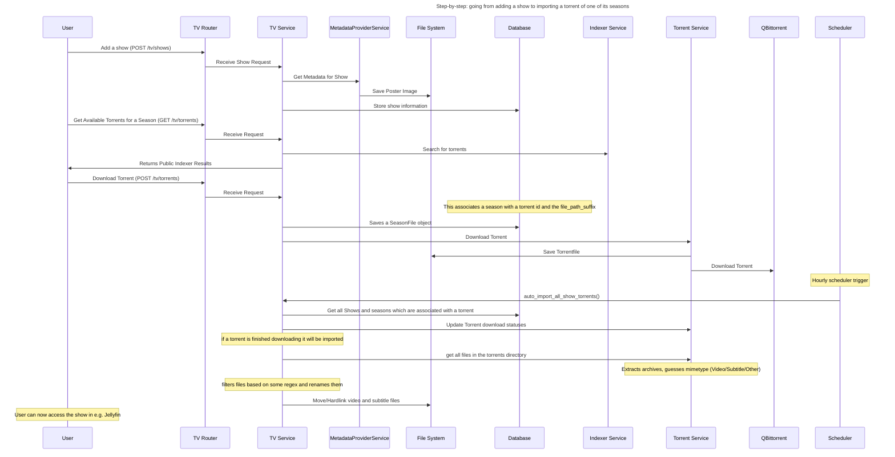

# Developer Guide

This section is for those who want to contribute to Media Manager or understand its internals.

## Source Code directory structure

- `media_manager/`: Backend FastAPI application
- `web/`: Frontend SvelteKit application
- `Writerside/`: Documentation
- `metadata_relay/`: Metadata relay service, also FastAPI

## Special Dev Configuration

#### Env Variables

- `BASE_PATH`: this sets the base path for the app (can be set for both backend and frontend)
- `PUBLIC_VERSION`: this sets the version variable, it is displayed in the frontend (requires rebuilding of the
  frontend) and in the /api/v1/health endpoint (can be set for both backend and frontend)
- `FRONTEND_FILES_DIR`: directory for frontend files, e.g. in Docker container it is `/app/web/build` (only backend)

## Contributing

- Consider opening an issue to discuss changes before starting work

## Setting up the Development Environment

I use IntellijIdea with the Pycharm and Webstorm plugins to develop this, but this guide should also work with VSCode.
Normally I'd recommend Intellij, but unfortunately only Intellij Ultimate has support for FastAPI and some other
features.

### Recommended VSCode Plugins:

- Python
- Svelte for VSCode
- and probably more, but I don't use VSCode myself, so I can't recommend anymore.

### Recommended Intellij/Pycharm Plugins:

- Python
- Svelte
- Pydantic
- Ruff
- VirtualKit
- Writerside (for writing documentation)

### Other recommendations

I recommend developing using Docker, i.e. you can use the provided `docker-compose.dev.yaml` file. This dev
docker-compose file has the `./media_manager` directory mounted at `/app/media_manager` in the container, meaning you
can run the code using the container in exactly the environment it will be running in.

Additionally, to develop the frontend I use a locally installed Node.js server. So basically a hybrid approach, where
the backend runs in a container and the frontend runs on Windows. To make this work, you need to make sure the
`cors_urls` and `frontend_url` are set correctly in the backend's config file.

Unfortunately, a side effect of this setup is that you have to rebuild the Docker image everytime when you change the
python dependencies in any way or at least restart the container if you change the code. For a fast-paced development it
may be more convenient to run the backend locally too, because then it supports hot reloading.

### Setting up the basic development environment with Docker

- Copy the `config.dev.toml` file to `config.toml` in the `./res` directory and edit it to your needs.
- Use the following command to start the development environment with Docker:
    ```bash
    docker compose up -d -f docker-compose.dev.yaml
    ```

### Setting up the backend development environment

1. Clone the repository
2. cd into repo root
3. [Install `uv`.](https://docs.astral.sh/uv/getting-started/installation/)
4. run `uv --version` to verify that `uv` is installed correctly
5. Install python if you haven't already:
    ```bash
    uv python install 3.13
    ```
6. Create a virtual environment with uv
    ```bash
    uv venv --python 3.13
    ```

7. Install dependencies:
    ```bash
    uv sync
    ```

8. run db migrations with
    ```bash
      uv run alembic upgrade head
   ```

9. run the backend with
    ```bash
    uv run ./media_manager/main.py --reload --port 8000
    ```

- format code with `uvx ruff format`
- lint code with `uvx ruff check`

### Setting up the frontend development environment

1. Clone the repository
2. cd into repo root
3. cd into `web` directory
4. install Node.js and npm if you haven't already, I
   used [nvm-windows](https://github.com/coreybutler/nvm-windows?tab=readme-ov-file):
    ```powershell
    nvm install 24.1.0
    nvm use 24.1.0
    ```
   I also needed to run the following command to be able to use `npm`:
   ```powershell
   Set-ExecutionPolicy -ExecutionPolicy RemoteSigned -Scope CurrentUser
   ```
5. Install the dependencies with npm: `npm install`
6. Start the frontend development server: `npm run dev`

- format the code with `npm run format`
- lint the code with `npm run lint`

## Sequence Diagrams



## Tech Stack

### Backend

- Python with FastAPI
- SQLAlchemy
- Pydantic and Pydantic-Settings
- Alembic

### Frontend

- TypeScript with SvelteKit
- Tailwind CSS
- shadcn-svelte

### CI/CD

- GitHub Actions
