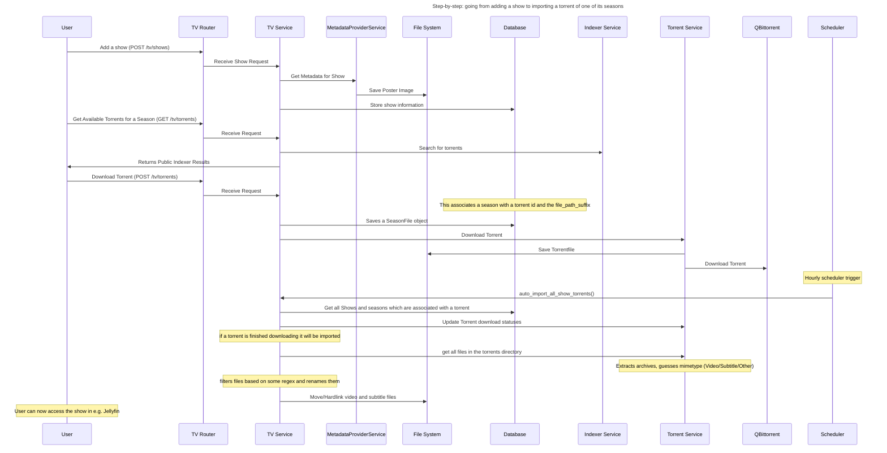

# Developer Guide

This section is for those who want to contribute to Media Manager or understand its internals.

### Source Code

- `media_manager/`: Backend FastAPI application
- `web/`: Frontend SvelteKit application
- `Writerside/`: Documentation
- `metadata_relay/`: Metadata relay service
-

### Backend Development

- Uses `uv` for dependency management
- Follows standard FastAPI project structure
- Database migrations are handled by Alembic

### Frontend Development

- Uses `npm` for package management
- SvelteKit with TypeScript

### Contributing

- Consider opening an issue to discuss significant changes before starting work

## Sequence Diagrams

## Tech Stack

### Backend

- Python with FastAPI
- SQLAlchemy
- Pydantic and Pydantic-Settings

### Frontend

- TypeScript with SvelteKit
- Tailwind CSS
- shadcn-svelte

### CI/CD

- GitHub Actions
