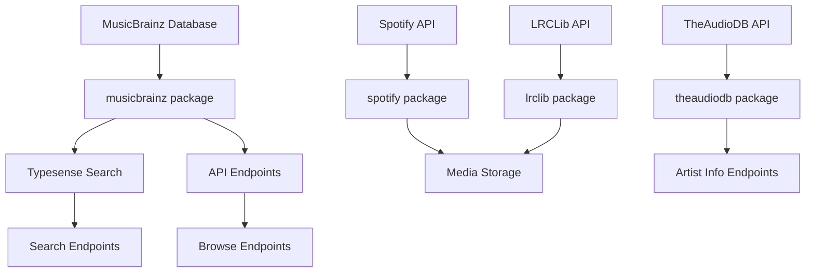

# Music Services

This directory contains all music-related services and integrations for the Media Manager metadata relay.

## Architecture Overview

The music services are organized into several specialized packages:

```
app/music/
├── musicbrainz/     # Core music database and API endpoints
├── typesense/       # Full-text search and indexing
├── theaudiodb/      # Artist information and images
├── spotify/         # Artist image downloads
├── lrclib/          # Lyrics fetching and storage
└── media.go         # Backwards compatibility layer
```

## Services

### 🎵 MusicBrainz (`musicbrainz/`)
**Core music metadata database and API**

- **Purpose**: Primary source of music metadata (artists, albums, tracks, relationships)
- **Database**: PostgreSQL connection to MusicBrainz database replica
- **API Endpoints**: REST endpoints for searching and browsing music entities
- **Key Features**:
  - Artist search, browsing, and metadata retrieval
  - Release group and release management
  - Recording (track) information
  - Advanced search with multiple criteria
  - Wikipedia integration for artist biographies

### 🔍 Typesense (`typesense/`)
**Full-text search and real-time indexing**

- **Purpose**: Provides fast, typo-tolerant search across all music entities
- **Technology**: Typesense search engine with structured collections
- **Key Features**:
  - Real-time search with relevance scoring
  - Automatic indexing from MusicBrainz database
  - Optimized queries with field weighting
  - Background sync scheduler for data freshness
  - Bulk import with retry logic and backpressure handling

### 🎨 TheAudioDB (`theaudiodb/`)
**Artist information and artwork**

- **Purpose**: Extended artist information, biographies, and high-quality artwork
- **Integration**: API-based service for artist metadata enrichment
- **Key Features**:
  - Artist search by name or MusicBrainz ID
  - Album lookup by MusicBrainz release group ID
  - Track lookup by MusicBrainz recording ID
  - High-resolution artist images and fanart
  - Artist biographies and additional metadata
  - Prioritized caching for MBID-based lookups (7-day TTL)

### 🎧 Spotify (`spotify/`)
**Artist image downloads**

- **Purpose**: Downloads and caches artist images from Spotify's extensive catalog
- **Authentication**: OAuth 2.0 client credentials flow
- **Key Features**:
  - Artist image search and download
  - Local caching to media directory
  - Automatic token refresh
  - Rate limiting and error handling

### 📝 LRCLib (`lrclib/`)
**Lyrics fetching and storage**

- **Purpose**: Fetches synchronized lyrics in LRC format for tracks
- **API**: LRCLib.net integration for community-sourced lyrics
- **Key Features**:
  - Track lyrics by artist and title
  - LRC format with timing synchronization
  - Local storage for offline access

## Data Flow



## Integration Points

### Search Integration
- **Primary**: Typesense provides the main search functionality
- **Fallback**: Direct MusicBrainz database queries for complex searches
- **Caching**: Redis caching layer for frequently accessed data

### Media Enrichment
- **Images**: Spotify API provides high-quality artist images
- **Lyrics**: LRCLib API provides synchronized lyrics
- **Metadata**: TheAudioDB provides additional artist information

### Background Processing
- **Sync Scheduler**: Keeps Typesense index up-to-date with MusicBrainz data
- **Bulk Operations**: Efficient batch processing for large data sets
- **Error Handling**: Retry logic and graceful degradation

## Configuration

Each service can be independently enabled/disabled via environment variables:

- `MUSICBRAINZ_DB_*`: Database connection settings
- `TYPESENSE_*`: Search engine configuration  
- `SPOTIFY_CLIENT_*`: Spotify API credentials
- `THEAUDIODB_API_KEY`: TheAudioDB API access
- `LRCLIB_BASE_URL`: LRCLib API endpoint
- `SYNC_*`: Background sync settings

## API Endpoints

### MusicBrainz Routes (`/musicbrainz/`)
- `GET /artists/search` - Search artists
- `GET /artists/{mbid}` - Get artist details
- `GET /release-groups/search` - Search albums
- `GET /releases/search` - Search releases
- `GET /recordings/search` - Search tracks

### TheAudioDB Routes (`/theaudiodb/`)
- `GET /artist?name={name}` - Search artist information by name
- `GET /artist/{mbid}` - Get artist information by MusicBrainz ID (prioritized caching)
- `GET /album/{mbid}` - Get album information by MusicBrainz release group ID (prioritized caching)
- `GET /track/{mbid}` - Get track information by MusicBrainz recording ID (prioritized caching)

### Media Files (`/media/`)
- Static file serving for images and lyrics
- Organized by service (spotify/, lyrics/)

## Performance Considerations

- **Database Connection Pooling**: Optimized PostgreSQL connections
- **Search Indexing**: Parallel processing with configurable workers
- **Caching Strategy**: Multi-layer caching (Redis, in-memory, disk)
- **Rate Limiting**: Respectful API usage for external services
- **Background Processing**: Non-blocking sync operations
